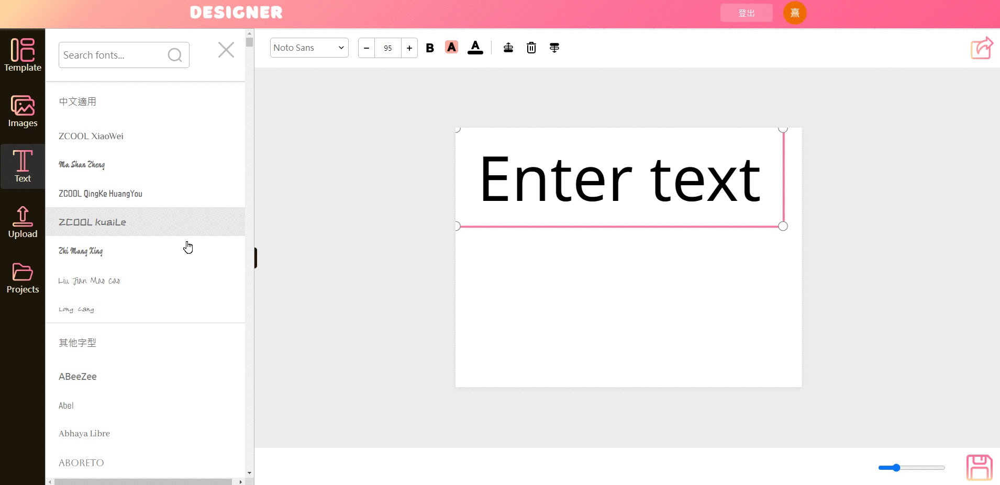
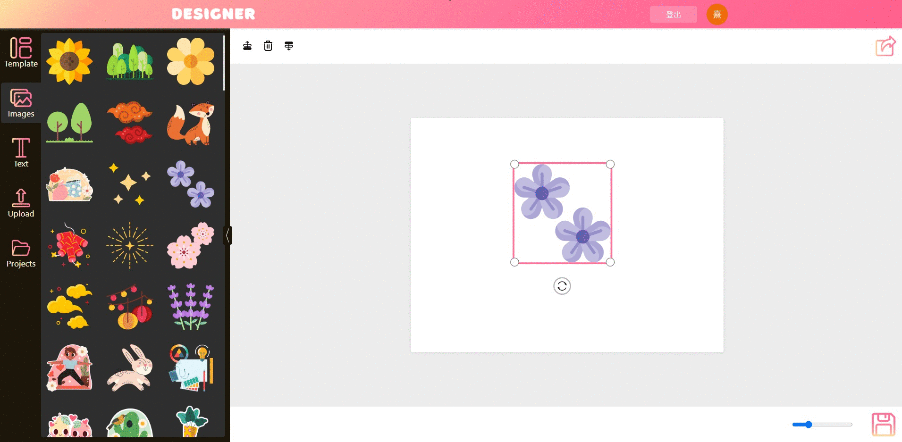
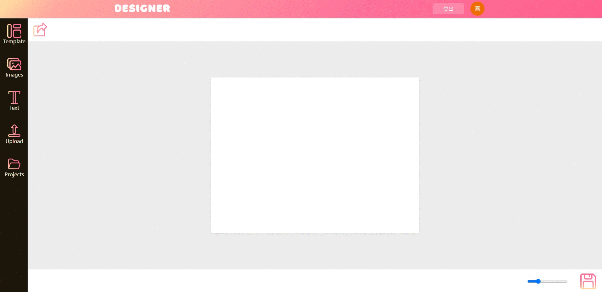
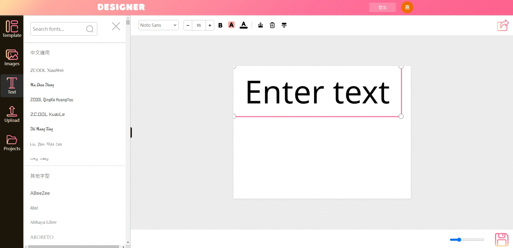
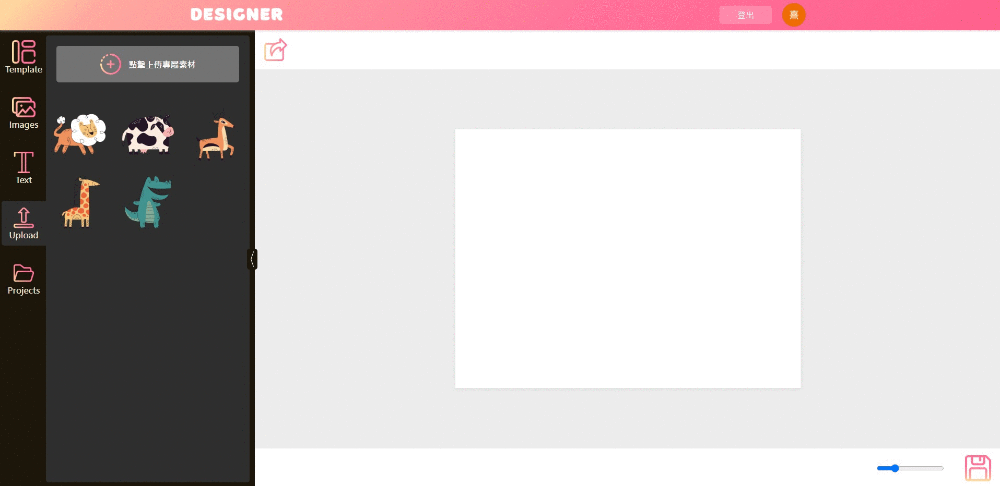

# Designer
Online poster and card editing website.

## Feature description
* Using IntersectionObserver for dynamic loading fonts.

* Smooth image rotation and scaling.

* Storage and editing of projects

* Font background, color, and size changes

* Paste and upload image material

## Skills
* Using Firebase Hosting, SPA is implemented through React Router, useContext is used to manage login status.
* Implement project storage and loading in conjunction with Firestore.
